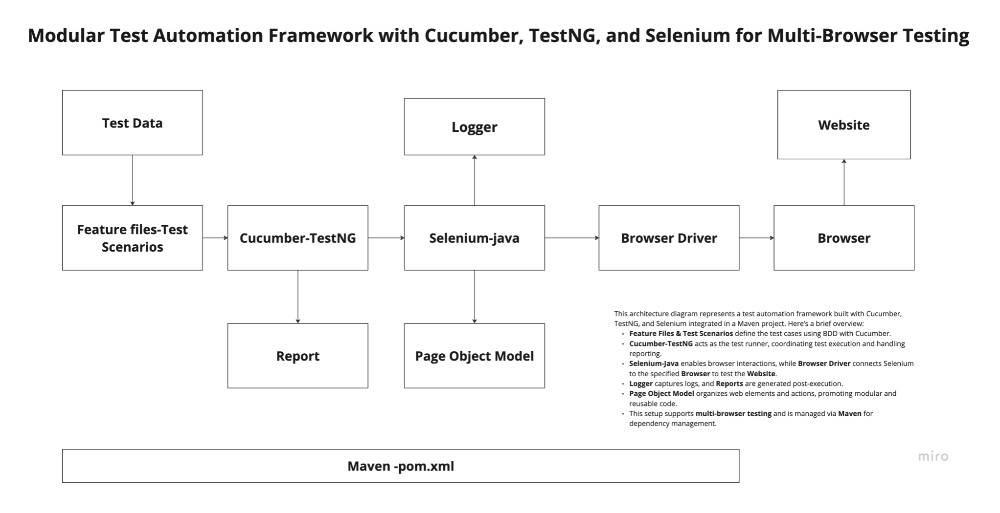

# Web Automation Testing Framework


## 🚀 Overview
This is a robust test automation framework built using Selenium WebDriver, Java, TestNG, and Cucumber. The framework supports multi-browser testing and follows a modular, page object model architecture.

## 🛠 Tech Stack
- **Java:** Core programming language (JDK 17+)
- **Maven:** Dependency management and build tool
- **Selenium WebDriver:** Web automation tool
- **TestNG:** Test execution framework
- **Cucumber:** BDD framework
- **SL4j:** Logging framework
- **Cucumber Reports:** Reporting tool
- **SnakeYAML:** Configuration management
- **WebDriverManager:** Browser driver management


## 🔄 Prerequisites
1. JDK 11 or higher
2. Maven 3.8.x or higher
3. Chrome/Firefox/Edge browsers
4. Git

## 🚀 Getting Started
1. Clone the repository:
```bash
git clone https://github.com/chethanshivu/nba-ui-test-automation.git
```

2. Install dependencies:
```bash
mvn clean install -DskipTests
```

3. Run tests:
```bash
# Run all tests
mvn test
```


## 📊 Reporting
- Test execution reports are generated in `target/cucumber-reports`

## 🔍 Key Features
1. **Cross-browser Testing**: Support for Chrome, Firefox, and Edge
2. **Parallel Execution**: TestNG parallel execution capabilities
3. **Screenshot Capture**: Automatic capture on test failure
4. **Data-Driven**: Support for Excel, CSV, and YAML data sources
5. **BDD**: Cucumber integration for behavior-driven development
6. **Page Object Model**: Modular and maintainable page objects
7. **Logging**: Comprehensive logging with SL4j
8. **Reporting**: Detailed HTML reports
9. **Reusable Components**: Common utilities module

## 🏗 Framework Architecture




